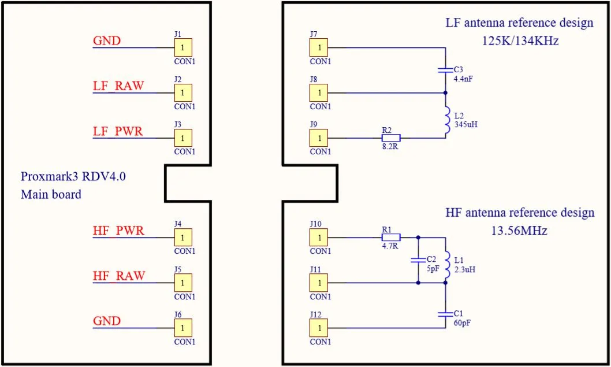

# PM5 RDV4 Antenna Adapter

## Antenna interface

> **Viewpoint convention:** unless stated otherwise, all **RDV4** orientations
> in this document are as seen **from the top**, and all **PM5** orientations are
> as seen **from the bottom**. (The one exception is the PM5 10P header pinout
> below, which keeps the orientation stated in the proxmark3 docs.)

Both the Proxmark3 RDV4 and the PM5 expose **two 3-pin antenna connectors** —
one for the HF antenna and one for the LF antenna — each with the same signals:

| Pin       | Description         |
| --------- | ------------------- |
| GND       | Ground              |
| RAW       | Raw antenna signal  |
| PWR (DRV) | Drive / power       |

On the RDV4 the pins are labelled `GND` / `LF_RAW` / `LF_PWR` (and the `HF_*`
equivalents); on the PM5 silkscreen the drive pin is labelled `DRV`.

> **Note — pin order differs between boards.** On the PM5 both bands run in the
> same direction (`GND` → `RAW` → `DRV`). The RDV4 does **not** match this, so do
> not assume the RDV4 order matches the PM5 when wiring an adapter.

On the RDV4, viewed **top-down**, the **left** antenna connection is **HF** and
the **right** is **LF**. Reading left-to-right:

| Band       | Left → right           |
| ---------- | ---------------------- |
| HF (left)  | `GND` → `RAW` → `PWR`   |
| LF (right) | `PWR` → `RAW` → `GND`   |

So the two RDV4 bands are mirrored, and the LF order is reversed relative to the
PM5's `GND` → `RAW` → `DRV`.

### RDV4 antenna interface



### PM5 (ICX301) antenna interface


The PM5 uses ICX301 connectors:

| Part number    | Gender | Mounted on                          |
| -------------- | ------ | ----------------------------------- |
| ICX301PT-MGY   | Male   | PM5 board (carries the center pins) |
| ICX301PT-FGY   | Female | Antenna (pins mate into it)         |

The PM5 board carries the **male** connector — it has the actual center pins —
and the antenna carries the **female** connector that those pins mate into.

#### Extra connector on the PM5 antenna

Unlike the RDV4 antenna, the PM5 antenna also carries a **10-pin (2x5) 2.54 mm**
header, with the **male pins on the antenna** side. Viewed from below, it sits on
the **far right** side, beyond the ICX301 connectors (HF left, LF right).

This mates with the PM5 **main board 10P Connect header** — a general-purpose
breakout, not antenna-specific. On the shipped antenna the antenna controller
uses the **I2C SDA/SCL** lines (system I2C bus) to talk to the host; the rest of
the pins are unused by the antenna.

**Pinout** (per the proxmark3 docs — orientation: directly viewing the 10P
connector with the machine's decorative side facing up, ICX301 connectors on the
right):

```
 UART_TX   UART_RX   I2C_SDA   SWDIO   SWCLK
 MCU_RST  DBG_PWR_ON  VCC5V4   I2C_SCL   GND
```

| Signal        | MCU pin        | Notes                                                  |
| ------------- | -------------- | ------------------------------------------------------ |
| UART_TX / RX  | `PA2` / `PA3`  | UART or GPIO; 3.3 V                                     |
| I2C_SDA / SCL | `PC7` / `PC6`  | System I2C bus — antenna controller talks here; 3.3 V  |
| SWDIO / SWCLK | `PA13` / `PA14`| SWD debug / flash; 3.3 V                                |
| MCU_RST       | MCU RESET      | 3.3 V pull-up; pull low to reset MCU                   |
| DBG_PWR_ON    | —              | Debug power-on (2.0–15 V high); overrides power switch |
| VCC5V4        | —              | ~5.4 V DCDC output only (<300 mA); do not feed power in|
| GND           | —              | Ground                                                 |

Source: `proxmark3/doc/md/Development/PM5_VERE_Hardware_RM.md` §5.1 and the
antenna controller manual `proxmark3/doc/md/PM5_Controllers/PM5_ANT_Controller_RM.md`
(I2C slave `0x51`).

#### Physical pin layout (PM5)

Viewed from **below** the board, the HF connector is on the **left** and the LF
connector is on the **right**. Each connector's pins run left-to-right in the
same order:

```
        (viewed from below)

        HF                    LF
   GND  RAW  DRV         GND  RAW  DRV
   left ------> right    left ------> right
```

## Reference measurements — Proxmark3 RDV4 default antenna

Output of `hw tune` on a Proxmark3 RDV4 with the stock/default antenna, used
as a baseline reference. Q factor must be measured **without a tag on the
antenna**.

### LF Antenna (RDV4)

| Measurement            | Value     |
| ---------------------- | --------- |
| 125.00 kHz             | 36.84 V   |
| 134.83 kHz             | 25.92 V   |
| 123.71 kHz (optimal)   | 36.88 V   |
| Frequency bandwidth    | 5.7       |
| Peak voltage           | 6.4       |
| LF antenna             | ok        |

### HF Antenna (RDV4)

| Measurement            | Value     |
| ---------------------- | --------- |
| 13.56 MHz              | 48.46 V   |
| Peak voltage           | 8.5       |
| HF antenna             | ok        |

### LF tuning graph (RDV4)

- Orange line — divisor 95 / 125.00 kHz
- Blue line — divisor 88 / 134.83 kHz

## Reference measurements — PM5 default antenna

Output of `hw tune` on a PM5 with the stock/default antenna. Q factor must be
measured **without a tag on the antenna**.

### LF Antenna (PM5)

| Measurement            | Value     |
| ---------------------- | --------- |
| 125.00 kHz             | 23.83 V   |
| 134.83 kHz             | 18.30 V   |
| 121.21 kHz (optimal)   | 24.15 V   |
| Frequency bandwidth    | 3.9       |
| Peak voltage           | 7.0       |
| LF antenna             | ok        |

### HF Antenna (PM5)

| Measurement            | Value     |
| ---------------------- | --------- |
| 13.56 MHz              | 41.78 V   |
| Peak voltage           | 12.1      |
| HF antenna             | ok        |

### LF tuning graph (PM5)

- Orange line — divisor 95 / 125.00 kHz
- Blue line — divisor 88 / 134.83 kHz
