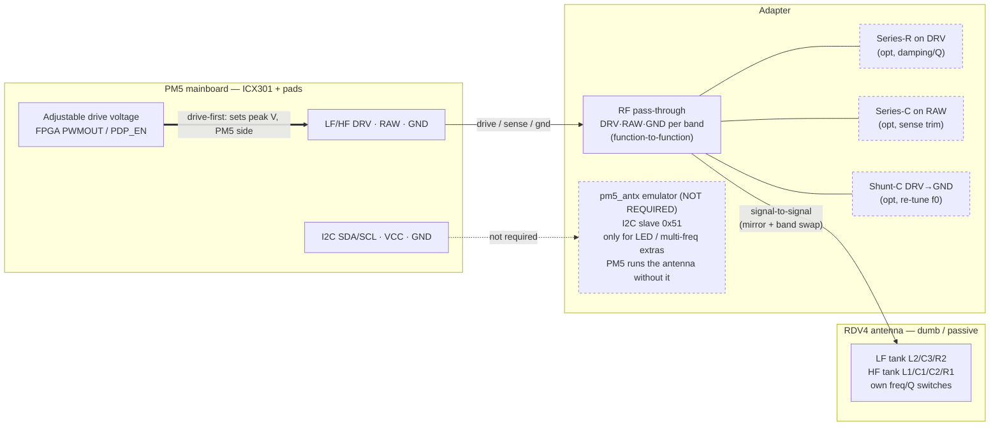
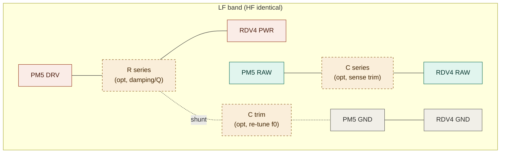
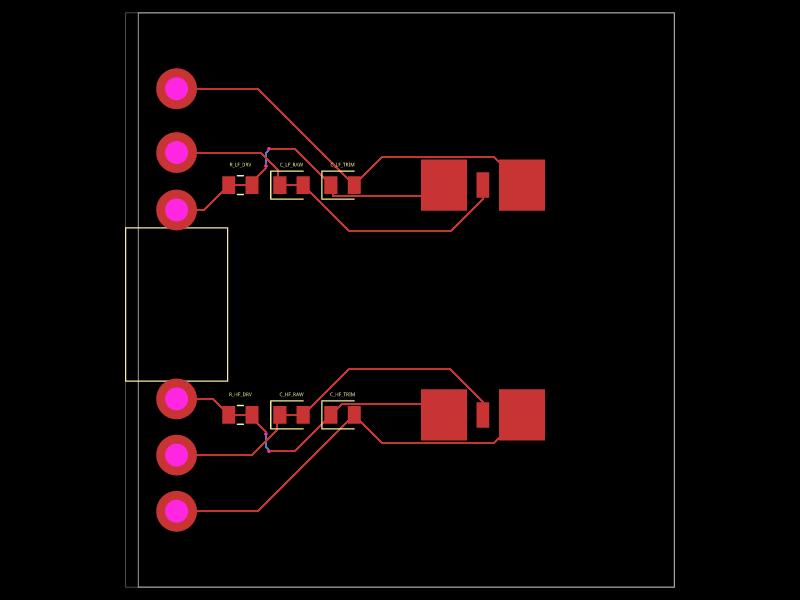
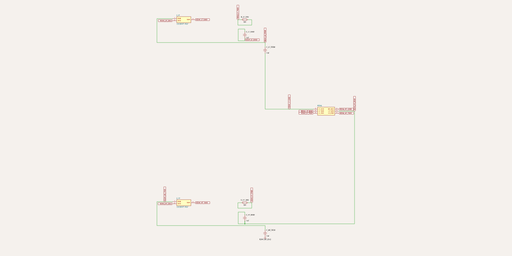

# PM5 RDV4 Antenna Adapter

## Antenna interface

> **Viewpoint convention:** unless stated otherwise, all orientations in this
> document — both **RDV4** and **PM5** — are as seen **from the top**. (The one
> exception is the PM5 10P header pinout below, which keeps the orientation
> stated in the proxmark3 docs.)

Both the Proxmark3 RDV4 and the PM5 expose **two 3-pin antenna connectors** —
one for the HF antenna and one for the LF antenna — each with the same signals:

| Pin       | Description         |
| --------- | ------------------- |
| GND       | Ground              |
| RAW       | Raw antenna signal  |
| PWR (DRV) | Drive / power       |

On the RDV4 the pins are labelled `GND` / `LF_RAW` / `LF_PWR` (and the `HF_*`
equivalents); on the PM5 silkscreen the drive pin is labelled `DRV`.

Both boards use the same three signals (`GND` / `RAW` / `PWR`≡`DRV`). Both are
**mirror-symmetric** about the board centre — `GND` outermost, `PWR`/`DRV`
innermost — so each board's two bands read in opposite order. The bands are
**swapped side-to-side** between the boards: RDV4 has **HF on the left**, PM5 has
**LF on the left**.

Top-down, reading left-to-right:

| Board | Left band              | Right band             |
| ----- | ---------------------- | ---------------------- |
| RDV4  | **HF:** `GND`→`RAW`→`PWR` | **LF:** `PWR`→`RAW`→`GND` |
| PM5   | **LF:** `GND`→`RAW`→`DRV` | **HF:** `DRV`→`RAW`→`GND` |

Because of the mirror **and** the band swap, physical position never lines up —
always wire **signal-to-signal** (`DRV`→`PWR`, `RAW`→`RAW`, `GND`→`GND`), per
band, never straight-through by position.

### RDV4 antenna interface


Physical interface with dimensions:


> The **center connector** (LF_IN, PWR_HI, PWR_OE1, VMID, 5V, USB, etc.) is
> **not used for the antenna** — only the six outer pads (LF: `GND`/`RAW`/`PWR`,
> HF: `PWR`/`RAW`/`GND`) form the antenna interface.

The RDV4 antenna has a physical control for the **LF tank only** — there is none
for HF (the HF tank is fixed):

The RDV4 antenna has **two physical toggle switches** (both confirmed on
hardware):

- **Q factor** — high/low damping (observed Q ≈ **14** or **7**).
- **LF frequency** — selects **125 kHz** or **134 kHz**.

> The proxmark3 docs are incomplete here: they call the Q control a "physical
> button" and list multi-frequency LF as a PM5-only new feature
> (`PM5_VERE_Hardware_RM.md` §8.1), implying no RDV4 frequency switch. The actual
> RDV4 antenna has **both** as toggle switches — hardware observation wins. (The
> PM5 replaced both with I2C control and added the 250/375/500 kHz steps.)

> ⚠️ These switch Q figures (14/7) don't line up with the `hw tune`-derived
> **Q≈22** in the [RDV4 LF measurements](#lf-antenna-rdv4). The switch position
> during that capture wasn't recorded, and the `hw tune` f₀/BW estimate and the
> antenna's nominal Q labels may simply be defined differently. Treat both as
> unreconciled until a capture is taken with a known switch position.

These are set on the antenna itself. When driving an RDV4 antenna from a PM5,
tuning/Q is chosen **here, on the antenna** — the PM5 has no way to change them
in software, because there is no antenna controller in this path.

#### PM5 antenna — switching is done in software (I2C)

Where the RDV4 antenna uses physical switches, the **PM5's own antenna does the
equivalent over I2C** via its on-board antenna controller (I2C slave `0x51`). No
jumpers — the host writes a register. Per
`proxmark3/doc/md/PM5_Controllers/PM5_ANT_Controller_RM.md`, the IO mapping
register `0x02` selects frequency and Q:

| Bit | Function        | Notes                                             |
| :-: | --------------- | ------------------------------------------------- |
| 7   | 125 kHz enable  | LF frequency…                                     |
| 6   | 134 kHz enable  | …at most one freq bit set; low→high priority;     |
| 5   | 250 kHz enable  | all-zero falls back to 125 kHz                    |
| 4   | 375 kHz enable  |                                                   |
| 3   | 500 kHz enable  |                                                   |
| 2   | HF LED          | 1 = on                                            |
| 1   | LF LED          | 1 = on                                            |
| 0   | Q value         | 1 = high Q / 0 = low Q — high Q only at 125/134 kHz |

So the PM5 antenna adds **more LF frequencies** (125/134/250/375/500 kHz, the
250/375/500 being new) and two blue LEDs beyond the RDV4. Power-on default is
125 kHz + low Q + LEDs off (`0x02` = `0x80`).

From the client, this register is driven by:

```
hw ant_pm5 -m --set <8bit data>
```

> ⚠️ **High Q is only allowed at 125/134 kHz** — the controller forces low Q at
> any other frequency to prevent excessive resonant voltage from damaging the
> device (`PM5_ANT_Controller_RM.md` §6; `Proxmark5-Instructions.md`).

> This applies to the **PM5's own** antenna. An **RDV4** antenna on a PM5 has no
> controller — you get whatever its physical Q/frequency switches are set to, and
> the emulator (if fitted) only satisfies the ID/LED side, not real tuning.

### PM5 (ICX301) antenna interface


The PM5 uses ICX301 connectors:

| Part number    | Gender | Mounted on                          |
| -------------- | ------ | ----------------------------------- |
| ICX301PT-MGY   | Male   | PM5 board (carries the center pins) |
| ICX301PT-FGY   | Female | Antenna (pins mate into it)         |

The PM5 board carries the **male** connector — it has the actual center pins —
and the antenna carries the **female** connector that those pins mate into.

**Datasheet / drawing (in the proxmark3 submodule):**
- `proxmark3/doc/datasheets/AMASS_ICX301PT_SPEC.pdf` — ICX301PT-M/F dims:
  body 11.10 mm wide, blade pitch **6.10 mm**, pad span 9.70 mm, female depth
  4.90 mm. 15 A / 500 V, brass gold-plated, PCB SMT. These are the numbers the
  `adapter/icx301.tsx` footprint is built from.
- `proxmark3/doc/img/pm5/icx301-and-10p-header.jpg` — official PM5 drawing that
  confirms the pin order (LF `GND RAW DRV` / HF `DRV RAW GND`, RAW = the small
  centre signal pin) and the inter-connector spacing (LF-DRV↔HF-DRV = 16 mm).

#### Extra connector on the PM5 antenna

Unlike the RDV4 antenna, the PM5 antenna also carries a **10-pin (2x5) 2.54 mm**
header, with the **male pins on the antenna** side. Viewed from the **top**, it
sits on the **far left**, beyond the LF connector (LF left, HF right).

This mates with the PM5 **main board 10P Connect header** — a general-purpose
breakout, not antenna-specific. On the shipped antenna the antenna controller
uses the **I2C SDA/SCL** lines (system I2C bus) to talk to the host; the rest of
the pins are unused by the antenna.

**Pinout** — reproduced **verbatim from the proxmark3 docs** in their own stated
orientation: *directly viewing the 10P connector with the machine's decorative
side facing up, ICX301 connectors on the right.* Note this is the docs' own frame
for the **mainboard** header and differs from the top-down antenna convention
used elsewhere here, so read the pad positions in that stated orientation.

```
 UART_TX   UART_RX   I2C_SDA   SWDIO   SWCLK
 MCU_RST  DBG_PWR_ON  VCC5V4   I2C_SCL   GND
```

| Signal        | MCU pin        | Notes                                                  |
| ------------- | -------------- | ------------------------------------------------------ |
| UART_TX / RX  | `PA2` / `PA3`  | UART or GPIO; 3.3 V                                     |
| I2C_SDA / SCL | `PC7` / `PC6`  | System I2C bus — antenna controller talks here; 3.3 V  |
| SWDIO / SWCLK | `PA13` / `PA14`| SWD debug / flash; 3.3 V                                |
| MCU_RST       | MCU RESET      | 3.3 V pull-up; pull low to reset MCU                   |
| DBG_PWR_ON    | —              | Debug power-on (2.0–15 V high); overrides power switch |
| VCC5V4        | —              | ~5.4 V DCDC output only (<300 mA); do not feed power in|
| GND           | —              | Ground                                                 |

Source: `proxmark3/doc/md/Development/PM5_VERE_Hardware_RM.md` §5.1 and the
antenna controller manual `proxmark3/doc/md/PM5_Controllers/PM5_ANT_Controller_RM.md`
(I2C slave `0x51`).

#### Physical pin layout (PM5) — confirmed

Viewed from the **top**, the LF connector is on the **left** and HF on the
**right**. Each band is mirrored about the board centre (`GND` outermost,
`DRV` innermost). Reading left-to-right:

```
        (viewed from top)

        LF                    HF
   GND  RAW  DRV         DRV  RAW  GND
```

This layout is **confirmed** against a physical board.

## Adapter

The adapter connects a PM5 mainboard to an RDV4 (dumb/passive) antenna. The RF
path is a straight pass-through per band.

> **I2C / antenna controller is NOT required** (confirmed by DXL). The PM5 drives
> a passive antenna fine without any antenna controller on the bus — the adapter
> needs only the RF path. The `pm5_antx` emulator below is therefore **entirely
> optional**: it only answers the controller's I2C ID/registers (and can drive
> LEDs if fitted) — it **cannot** retune a passive RDV4 tank, so it adds no real
> frequency/Q control. The RF path works without it.



> **Matching is drive-first.** The passive footprints above are unpopulated by
> default — the primary way to match the RDV4 tank to the PM5 is the PM5's
> adjustable BOOST drive voltage, not a series/shunt network. See
> [Matching strategy](#matching-strategy--drive-first-passives-as-fallback).

### Signal mapping (function-to-function)

Wire by **function**, not by physical position. Both boards' orders are confirmed
(see the pin-order table above), but they never line up physically — each board
mirrors its two bands **and** the bands are swapped side-to-side — so `PWR`/`DRV`,
`RAW`, and `GND` must be matched signal-to-signal per band, never
straight-through by position.

The three RF nets are **not** symmetric — each carries a different (optional,
unpopulated-by-default) passive footprint. LF band drawn; HF is identical:



#### Matching strategy — drive-first, passives-as-fallback

Do **not** reach for a matching network first. The RDV4 tank already resonates
near ~124 kHz and its own R2 (8.2 Ω) sets its damping/Q; the PM5 uses the same
`DRV`/`RAW`/`GND` architecture, so f₀ should stay put when plugged in. Peak field
is set on the PM5 side by its adjustable **BOOST** drive voltage — an active,
firmware-side knob that is strictly better than burning signal in a series
resistor. So correct field/drive there first. (BOOST is set by the FPGA's
`PWMOUT` (pin 38) with `PDP_EN` (pin 42) enabling it — see
`PM5_VERE_Hardware_RM.md` §2 "Controllable antenna drive voltage".)

> The reference measurements below are **not** a before/after adapter comparison:
> they are two independent baselines of *different* antennas (RDV4 antenna on
> RDV4 board; PM5 antenna on PM5 board), taken in separate `hw tune` runs. Do not
> read the raw-voltage gap between them as an adapter drive delta.

So: **populate nothing by default; match via the PM5 drive-voltage knob, and
only fall back to passives if drive adjustment can't get you there.**

| Footprint         | Net       | Populate only to…                                    |
| ----------------- | --------- | ---------------------------------------------------- |
| Series-R          | DRV       | **reduce** Q if PM5 overdrives a too-high-Q tank — costs field |
| Trim-C (shunt)    | DRV → GND | re-land f₀ if measured resonance shifts off-band on PM5 |
| Series-C          | RAW       | fix sense loading if PM5's sense input misbehaves — likely never |
| —                 | GND       | nothing; straight through                            |

> The series-R is a **de-tuning** tool (adds damping), not a signal booster —
> adding it *lowers* the field. If the PM5 tank is under-driven, turn up the
> BOOST drive voltage instead.

> **Trim-C placement footgun.** The diagram draws the shunt trim-C from `DRV` to
> `GND` for convenience, but that node is the *driven* side — the RDV4 tank's own
> C3 already sits across L2, and a cap on the driven node may load the driver more
> than it retunes the tank. When you actually need to trim f₀, the more
> predictable spot is across the **resonant node (RAW–GND)**. Pick the pad
> accordingly once you're populating it.

## Board (tscircuit)

The board is built with [tscircuit](https://tscircuit.com) in `adapter/`
(`yarn build`). These renders are the current **skeleton** — net topology and
placement are in place but **mechanical geometry is stubbed** (ICX301 pad
dimensions and RDV4 spacings are placeholders pending datasheets), so treat them
as structural previews, not fabrication-ready.

**PCB** — RDV4 SMT-nut pad column on the left edge, center-connector keep-out,
DNP trim passives, and the two ICX301 connectors on the right:



**Schematic** — function-to-function wiring per band, with the DNP trim parts
(`R_*_DRV`, `C_*_RAW`, `C_*_TRIM`) connected in parallel with the direct nets:



## PCB / layout guidance

**No controlled/matched-impedance PCB is needed** at these frequencies. The
adapter is electrically tiny — you are in the lumped-element regime, not the
transmission-line regime.

Transmission-line effects only matter once a trace is a meaningful fraction of a
wavelength (rule of thumb: length > λ/10):

| Signal      | λ (free space) | λ on FR4 (VF≈0.5) | λ/10 on board | Adapter trace |
| ----------- | -------------- | ----------------- | ------------- | ------------- |
| 13.56 MHz   | ~22.1 m        | ~11 m             | ~1.1 m        | ~cm           |
| 125/134 kHz | ~2400 m        | ~1200 m           | ~120 m        | ~cm           |

The traces are ~2–3 orders of magnitude shorter than even the strictest
threshold (at 13.56 MHz a few cm is ~0.3% of a wavelength — the trace is just a
wire). Also, the PM3 antenna path **is not a 50 Ω system**: it is an FPGA driving
a resonant LC tank, so "matching" here means **LC resonance tuning** (the
trim-C / series-R footprints above), not transmission-line impedance.

What actually matters is lumped parasitics, not trace geometry:

1. **Keep stray capacitance low and consistent.** Any capacitance the adapter
   adds to the `RAW`/`DRV` nets sits in parallel with the tank and shifts f₀
   (this is why the trim-C footprints exist). Short traces, small loop area, no
   unnecessary copper pour under the RAW node.
2. **Fat, low-resistance `DRV` traces.** The LF high-Q tank can pull significant
   drive current; size the drive copper for IR drop and heating. This is a
   DC/thermal concern, not an RF one.
3. **Low connector contact resistance.** ICX301 and the RDV4 pads add series R in
   the tank loop, which directly costs Q. Solid, low-resistance mating matters
   more than any trace tuning.

So: standard 2-layer FR4, short fat drive traces, minimal added stray C. No
impedance control, no length tuning, no reference-plane discipline required.

## Reference measurements — Proxmark3 RDV4 default antenna

Output of `hw tune` on a Proxmark3 RDV4 with the stock/default antenna, used
as a baseline reference. Q factor must be measured **without a tag on the
antenna**.

### LF Antenna (RDV4)

| Measurement                 | Value     |
| --------------------------- | --------- |
| 125.00 kHz (field)          | 36.84 V   |
| 134.83 kHz (field)          | 25.92 V   |
| 123.71 kHz optimal (field)  | 36.88 V   |
| Frequency bandwidth         | 5.7       |
| Approx. Q factor (derived)  | ≈22 (f₀/BW = 123.71/5.7) |
| Peak voltage¹               | 6.4       |
| LF antenna                  | ok        |

¹ *"Peak voltage" is the Q-estimator's internal figure, **not** a field voltage
in volts. The field readings are the "(field)" rows above (e.g. 36.88 V).*

### HF Antenna (RDV4)

| Measurement            | Value     |
| ---------------------- | --------- |
| 13.56 MHz (field)      | 48.46 V   |
| Peak voltage¹          | 8.5       |
| HF antenna             | ok        |

¹ Q-estimator figure, not field volts (see LF note).

### LF tuning graph (RDV4)

- Orange line — divisor 95 / 125.00 kHz
- Blue line — divisor 88 / 134.83 kHz

## Reference measurements — PM5 default antenna

Output of `hw tune` on a PM5 with the stock/default antenna. Q factor must be
measured **without a tag on the antenna**.

> **Provenance / conditions.** Firmware, and USB-vs-battery power state at capture
> time are **not recorded** — treat these as an uncalibrated baseline until
> re-captured under known conditions. This is a *different antenna* from the RDV4
> baseline, taken in a separate run; the two are not directly comparable (see the
> matching-strategy note). An earlier PM5 capture also raised a `hw tune` warning
> that turned out to be a **firmware bug**, not a hardware issue.

### LF Antenna (PM5)

| Measurement                 | Value     |
| --------------------------- | --------- |
| 125.00 kHz (field)          | 23.83 V   |
| 134.83 kHz (field)          | 18.30 V   |
| 121.21 kHz optimal (field)  | 24.15 V   |
| Frequency bandwidth         | 3.9       |
| Approx. Q factor (derived)  | ≈31 (f₀/BW = 121.21/3.9) |
| Peak voltage¹               | 7.0       |
| LF antenna                  | ok        |

¹ Q-estimator figure, not field volts (see RDV4 LF note).

### HF Antenna (PM5)

| Measurement            | Value     |
| ---------------------- | --------- |
| 13.56 MHz (field)      | 41.78 V   |
| Peak voltage¹          | 12.1      |
| HF antenna             | ok        |

¹ Q-estimator figure, not field volts.

### LF tuning graph (PM5)

- Orange line — divisor 95 / 125.00 kHz
- Blue line — divisor 88 / 134.83 kHz
